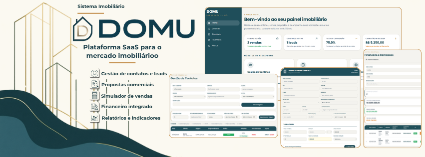
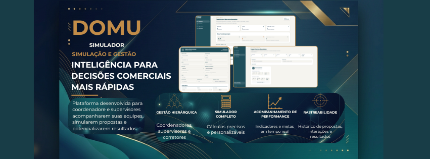

# Breno Oliveira

### 💻 Desenvolvedor Full Stack

Desenvolvo aplicações web e sistemas SaaS, atuando do **Front-end ao Back-end**, incluindo APIs, regras de negócio e bancos de dados.

Atualmente curso **Análise e Desenvolvimento de Sistemas (ADS)** e tenho foco na construção de soluções reais para negócios.

---

## 🚀 Principais Projetos

### 🏠 DOMU

  

**Plataforma SaaS voltada para gestão comercial imobiliária.**

CRM, gestão de leads, simulações, propostas, vendas, comissões, financeiro e controle de assinaturas.

**Minha atuação:** idealização, arquitetura e desenvolvimento Full Stack da plataforma.

 

 &nbsp;  &nbsp;  &nbsp;  &nbsp; 

  

[🌐 Ver projeto](LINK) • [📖 Ver case completo](LINK-DO-PORTFOLIO)

---

---

### 📊 DOMU Simulador

  

**Plataforma desenvolvida sob demanda para gestão e simulação comercial imobiliária.**

Sistema com hierarquia entre coordenadores e supervisores, simulação de propostas, acompanhamento de performance e rastreabilidade das operações comerciais.

**Minha atuação:** arquitetura e desenvolvimento Full Stack da solução, desde a estrutura de dados e regras de negócio até a interface da plataforma.

 

 &nbsp;  &nbsp;  &nbsp;  &nbsp; 

  

[📖 Ver case completo](LINK-DO-PORTFOLIO)

## 🤖 Linguagens e Tecnologias

 

  
  &nbsp;&nbsp;
  
  &nbsp;&nbsp;
  
  &nbsp;&nbsp;
  
  &nbsp;&nbsp;
  
  &nbsp;&nbsp;
  
  &nbsp;&nbsp;
  
  &nbsp;&nbsp;
  
  &nbsp;&nbsp;
  
  &nbsp;&nbsp;
  

 

---

## 🌐 Contato

 

  
  &nbsp;

  
   &nbsp;

  

